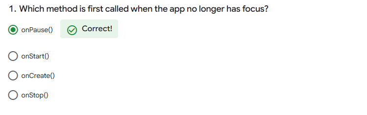
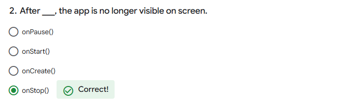
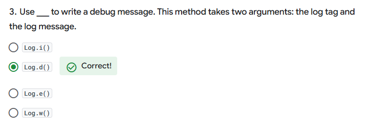
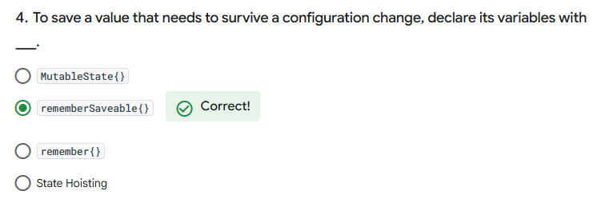
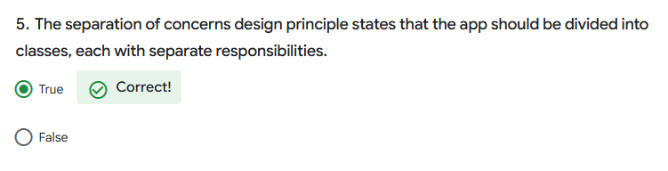
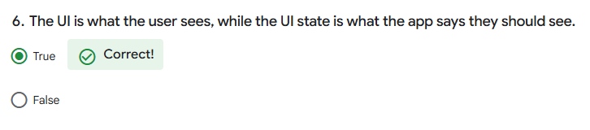
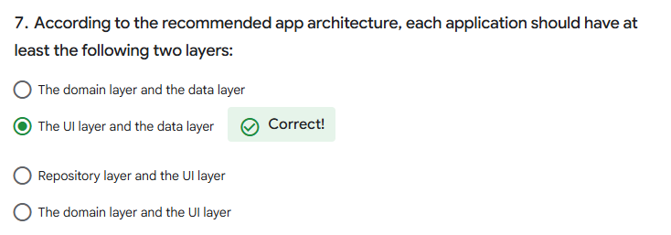
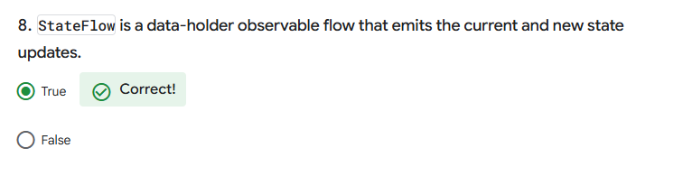
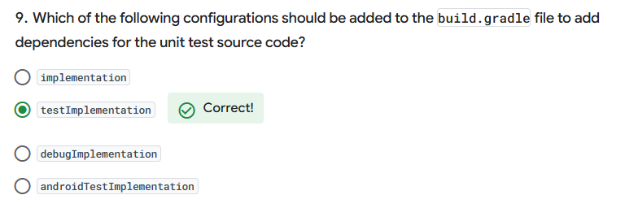
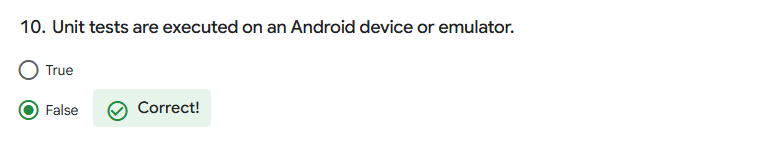

Dessert Clicker app
=====================

Code for Android Basics with Compose Codelab.

Introduction
------------

Dessert Clicker is a game about making desserts.

Press the button, make a dessert, earn the big bucks.

You use this app in the course to explore the Android lifecycle and log messages to
the Android console (Logcat).

Pre-requisites
--------------

You need to know:
- How to open, build, and run apps with Android Studio.
- What an activity is, and how to create one in your app.
- What the activity's onCreate() method does, and the kind of operations
  that are performed in that method.

Architecture Components Quiz
---------------

